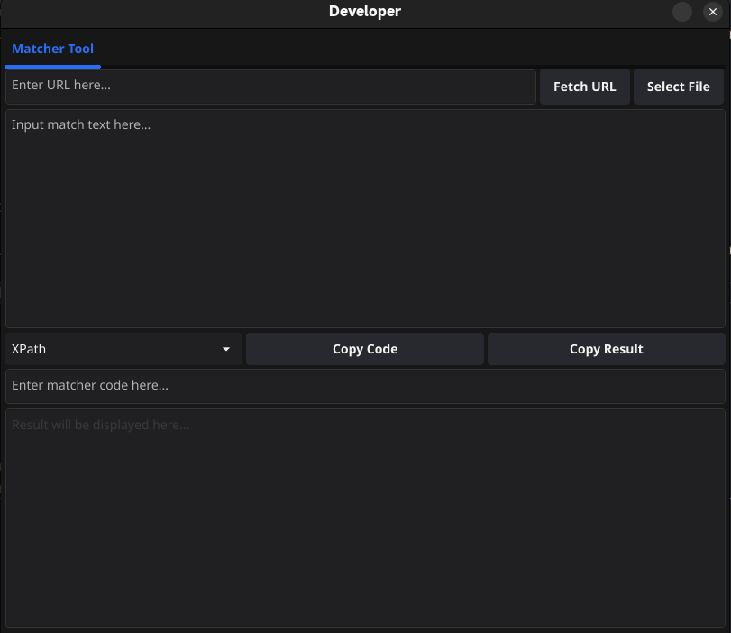

# Rabbit

Rabbit is a nimble and fast collection of practical development tools designed to enhance your workflow. The current version includes the Matcher Tool, which provides powerful text matching capabilities using XPath, CSS Selectors, and Regular Expressions. Rabbit aims to expand with more useful tools in the future, supporting various operating systems.

## Features

### Matcher Tool
- **Multiple Input Methods**: Input text by selecting a file, fetching content from a URL, or typing directly into the input box.
- **Matching Modes**: Choose between XPath, CSS Selectors, and Regular Expressions for text matching.
- **Real-time Matching**: Instantly see the matched results or error messages as you type the matcher code.
- **Copy Matcher Code**: Easily copy the matcher code for use in other programs.
- **User-friendly Interface**: Aesthetic and functional UI designed for ease of use with expanded text input and result display areas.


## Usage


### Matcher Tool

1. **Select Input Method**: Choose to either select a file, fetch content from a URL, or directly input text.
2. **Choose Matching Mode**: Select between XPath, CSS Selector, and Regular Expression from the dropdown menu.
3. **Enter Matcher Code**: Type your matcher code in the input box. The tool will instantly attempt to match the code and display the results or any error messages in the result area.
4. **Copy Matcher Code**: Use the "Copy Matcher Code" button to copy the matcher code for reuse in other programs.


## Interface Overview

### Matcher Tool

- **File Button**: Opens a file dialog to select a text file.
- **URL Entry**: Enter the URL to fetch content from.
- **Fetch URL Button**: Fetches and displays content from the specified URL.
- **Text Input Area**: Area to input or display fetched text.
- **Matching Mode Selector**: Dropdown menu to select the matching mode (XPath, CSS Selector, Regular Expression).
- **Matcher Code Input**: Input box for typing the matcher code.
- **Copy Button**: Copies the matcher code to the clipboard.
- **Result Display Area**: Displays the matched results or error messages.

## Screenshots




## Develop

1. Ensure you have [Go](https://golang.org/doc/install) installed on your system.
2. Clone this repository:

```sh
git clone https://github.com/atopx/rabbit.git
```

3. Navigate to the project directory:

```sh
cd rabbit
```

4. Install dependencies:

```sh
go mod tidy
```

5. Run the application:

```sh
go run main.go
```

## Contributing

We welcome contributions! Please fork the repository and submit pull requests for any enhancements, bug fixes, or additional features.

## License

This project is licensed under the MIT License. See the [LICENSE](LICENSE) file for details.
